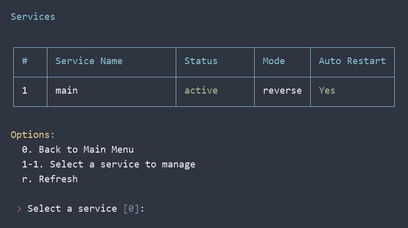
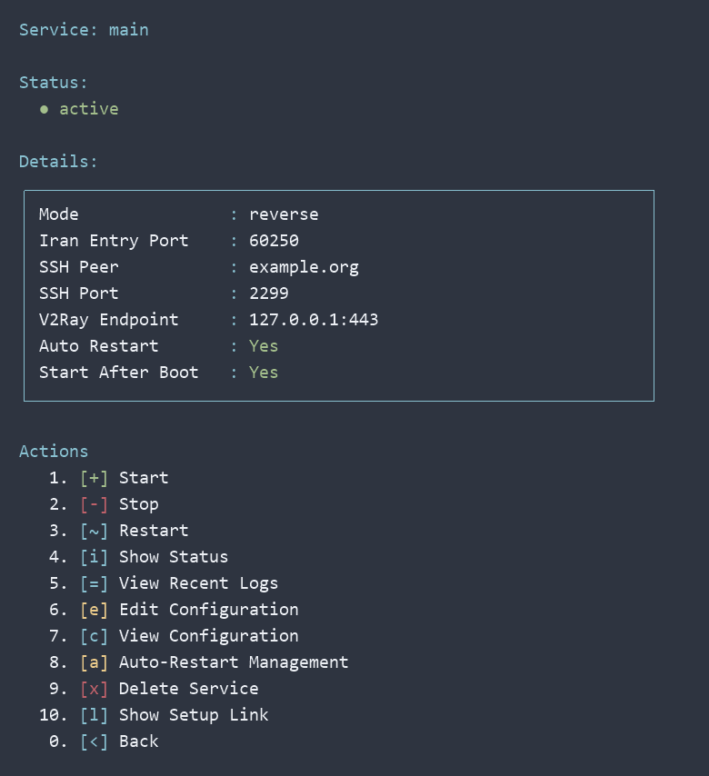

# SSH Reverse Tunnel — راهنمای فارسی

[English](README.md)

## دریافت و اجرا

روی هر دو سرور:

```bash
curl -fL --retry 3 -o ssh-tunnel.sh https://raw.githubusercontent.com/Mehdi81030/ssh-reverse-tunnel/main/ssh-tunnel.sh
sudo bash ssh-tunnel.sh
```

# راهنمای SSH Tunnel نسخه ۲

فایل `ssh-tunnel.sh` را روی هر دو سرور کپی و اجرا کنید:

```bash
sudo bash ssh-tunnel.sh
```

منوها انگلیسی‌اند و **رنگ‌ها به‌صورت پیش‌فرض فعال هستند**؛ اجرای عادی کافی است. جدول‌ها و عنوان بخش‌ها آبی، وضعیت فعال سبز، گزینه‌ها زرد، توقف و حذف قرمز، و مقادیر سفید نمایش داده می‌شوند. با انتخاب تونل از جدول، صفحهٔ جزئیات و عملیات آن باز می‌شود. فقط برای خروجی بدون رنگ، از `--no-color` یا `NO_COLOR=1` استفاده کنید.

ورودی‌ها با Backspace، Delete و کلیدهای جهت قابل‌ویرایش‌اند. اگر حرف فارسی یا اشتباهی را پاک کنید، فقط متن نهایی بررسی می‌شود. اعداد فارسی و عربی برای پورت‌ها و انتخاب گزینه‌های عددی پذیرفته می‌شوند.

به Linux با systemd فعال و دسترسی root نیاز دارد. هنگام راه‌اندازی تونل، ابزارهای موردنیاز بررسی می‌شوند و در صورت کمبود با apt یا dnf خودکار نصب می‌شوند؛ ابزارهای موجود دوباره نصب نمی‌شوند و گزینهٔ جداگانه‌ای برای پیش‌نیازها وجود ندارد. ابزارهای کلاینت روی آغازکننده و ابزارهای سرور و حساب روی دریافت‌کننده آماده می‌شوند. سرویس SSH دریافت‌کننده در صورت نیاز فعال و اجرا می‌شود؛ سرویس در حال اجرای SSH ری‌استارت نمی‌شود. انتقال فقط TCP است. پورت کانفیگ VLESS را وارد کنید، نه پورت وب پنل. فایروال، MTU و تنظیمات وی‌تو‌ری خودکار تغییر نمی‌کنند.

## نمای منو

نمونهٔ صفحه‌ها از خروجی واقعی منو با یک پروفایل نمایشی ساخته شده‌اند. پس‌زمینه و فونت به تنظیمات ترمینال شما بستگی دارند.





## منوی جدید

| گزینه | کاربرد |
|---|---|
| ۱ | راه‌اندازی ریورس؛ سپس انتخاب ایران یا خارج |
| ۲ | راه‌اندازی مستقیم؛ سپس انتخاب ایران یا خارج |
| ۳ — Manage Tunnels | جدول تمام تونل‌ها و باز کردن صفحهٔ مدیریت هر تونل |
| ۴ — Public Key | ساخت یا نمایش کلید عمومی |

در گزینه **۳**، شماره ردیف، نام سرویس، وضعیت، حالت و Auto Restart نمایش داده می‌شوند. انتخاب شمارهٔ ردیف، صفحهٔ مدیریت همان سرویس را باز می‌کند و چیزی حذف نمی‌شود. `r` برای تازه‌سازی جدول و `0` برای بازگشت است. ستون Role نمایش داده نمی‌شود.

صفحهٔ هر سرویس شامل وضعیت و کادر جزئیات پورت ورودی ایران، آدرس و پورت SSH، مقصد وی‌تو‌ری، Auto Restart و اجرای پس از بوت است. در پروفایل‌های قدیمی دریافت‌کننده، اطلاعاتی که ذخیره نشده‌اند با `-` نمایش داده می‌شوند.

| عملیات سرویس | کاربرد |
|---|---|
| ۱ / ۲ / ۳ | شروع / توقف / ری‌استارت سرویس اختصاصی تونل |
| ۴ — Show Status | نمایش وضعیت |
| ۵ — View Recent Logs | لاگ‌های اخیر و آخرین تلاش راه‌اندازی |
| ۶ — Edit Configuration | ویرایش تنظیمات و ری‌استارت سرویس |
| ۷ — View Configuration | نمایش تنظیمات، بدون نمایش محتوای کلید خصوصی |
| ۸ — Auto-Restart Management | مدیریت شروع مجدد با systemd |
| ۹ — Delete Service | حذف پس از تأیید نام سرویس |
| ۰ — Back | بازگشت به جدول |

شروع، توقف، ری‌استارت، ویرایش و Auto Restart فقط روی سروری نمایش داده می‌شوند که سرویس اختصاصی تونل را اجرا می‌کند. روی دریافت‌کننده، وضعیت، لاگ، مشاهدهٔ تنظیمات و حذف در دسترس‌اند؛ SSH اصلی سرور از این صفحه متوقف یا ری‌استارت نمی‌شود. `configured` یعنی تنظیمات دریافت‌کننده آماده‌اند و `active` یعنی پردازش تونل در حال اجراست. برای سلامت کامل اتصال، کلاینت واقعی را تست کنید. مقدار `Remote` در Auto Restart یعنی این تنظیم روی سمت دیگر مدیریت می‌شود.

ویرایش تنظیمات، آدرس‌ها و پورت‌ها را اعتبارسنجی می‌کند و در صورت تغییر مقصد SSH، اثر انگشت آن را دوباره تأیید می‌گیرد. اگر اعمال تغییر سرویس شکست بخورد، تنظیمات قبلی برگردانده می‌شوند. هنگام تغییر پورت ورودی یا مقصد وی‌تو‌ری، مجوز فوروارد سمت دریافت‌کننده را هم جداگانه هماهنگ کنید و پس از ذخیره، لاگ و کلاینت را بررسی کنید.

مدیریت Auto Restart سیاست ری‌استارت systemd همین تونل را تغییر می‌دهد. اعمال تغییر روی تونل فعال، پس از تأیید آن را ری‌استارت می‌کند. این گزینه از اجرای خودکار پس از بوت جداست.

## ریورس

خارج اتصال SSH را به ایران آغاز می‌کند. کاربر به ایران وصل می‌شود و وی‌تو‌ری روی خارج می‌ماند.

1. اسکریپت را روی هر دو سرور اجرا کنید؛ ابزارهای لازم هنگام شروع راه‌اندازی به‌صورت خودکار آماده می‌شوند.
2. روی **خارج** گزینه **۱** و سپس **۲: Kharej** را انتخاب کنید؛ نام مثلاً `main`.
3. کل خط عمومی `ssh-ed25519 ...` که نمایش داده می‌شود را کپی کنید. این ترمینال را باز نگه دارید.
4. روی **ایران** گزینه **۱** و سپس **۱: Iran** را بزنید؛ همان نام `main`. پورت ورودی کاربران و پورت واقعی SSH ایران را وارد و کلید عمومی خارج را Paste کنید.
5. به ترمینال خارج برگردید و آماده بودن ایران را با `y` تأیید کنید. آی‌پی ایران، پورت SSH ایران، پورت ورودی ایران و **Config port on kharej** را وارد کنید. آدرس مقصد خودکار روی `127.0.0.1` سرور خارج تنظیم می‌شود و پرسیده نمی‌شود.
6. اثر انگشت‌ها را با خروجی ایران مقایسه و در صورت مطابقت تأیید کنید. اسکریپت اتصال را تست و در صورت موفقیت سرویس را نصب می‌کند.

مثال تنظیمات:

```text
Iran SSH port:       22
Iran user port:      8443
Kharej V2Ray host:   127.0.0.1
Kharej V2Ray port:   443
Client destination: IP ایران و پورت 8443
```

در **Config port on kharej** پورت کانفیگ VLESS را وارد کنید، نه پورت وب پنل. مقصد روی `127.0.0.1` خارج ثابت است؛ سرویس باید از این آدرس قابل‌دسترسی باشد یا پورت کانتینر روی میزبان منتشر شده باشد. پورت ورودی ایران لازم نیست با پورت کانفیگ خارج برابر باشد و برای حساب محدود ریورس باید ۱۰۲۴ یا بالاتر باشد. آی‌پی و پورت کلاینت را تغییر دهید؛ UUID همان کانفیگ VLESS خارج می‌ماند. روی ایران پورت SSH و پورت کاربران را در فایروال سرور و دیتاسنتر مجاز کنید.

## مستقیم

همین مراحل را با گزینه **۲** انجام دهید. ابتدا **ایران** کلید عمومی را می‌سازد و **خارج** آن را ثبت می‌کند؛ سپس **ایران** اتصال SSH را به خارج آغاز می‌کند. مقصد کلاینت همچنان آی‌پی و پورت ورودی ایران است. پورت کانفیگ را روی هر دو سمت یکسان وارد کنید؛ آدرس مقصد خودکار `127.0.0.1` خارج است. روی خارج پورت SSH و روی ایران پورت کاربران را مجاز کنید.

## استفاده با تنظیمات نسخه قبلی

همان نام قبلی را استفاده کنید؛ اسکریپت کلید موجود را دوباره استفاده می‌کند. نیازی به حذف حساب و کلید قبلی نیست. اگر دریافت‌کننده قبلاً آماده شده باشد، مشخصات و اثر انگشت آن نمایش داده می‌شود و می‌توانید روی سمت دیگر ادامه دهید.

اگر آزمون با ۱۲۴ تمام شده و سرویس هنوز ایجاد نشده است، روی **خارج** گزینه **۱، سپس ۲: Kharej** را با همان نام `main` تکرار کنید. تست اتصال به‌صورت خودکار داخل راه‌اندازی انجام می‌شود و گزینهٔ مستقلی برای آن وجود ندارد.

## خطا و لاگ

کد **۱۲۴** یعنی آزمون به مهلت زمانی رسیده؛ به‌تنهایی علت قطع اتصال یا اشتباه بودن کلید را ثابت نمی‌کند. نسخه جدید SSH را با لاگ دقیق تست می‌کند، مرحله احتمالی توقف را توضیح می‌دهد و ۸۰ خط آخر لاگ را همان‌جا چاپ می‌کند. پس از خطا به منو بازمی‌گردد.

- مسیر **Manage Tunnels ← انتخاب سرویس ← ۵: View Recent Logs** حتی بدون نصب سرویس، آخرین لاگ راه‌اندازی را نمایش می‌دهد.
- روی دریافت‌کننده، عملیات **۵** لاگ SSH را نشان می‌دهد و عملیات **۷** تنظیمات حساب را نمایش می‌دهد.
- پس از شکست راه‌اندازی پیش از ایجاد سرویس، همان راه‌اندازی مستقیم یا ریورس را با نام قبلی تکرار کنید.
- مهلت آزمون ۳۰ ثانیه است؛ این تغییر به‌تنهایی اختلال مسیر را حل نمی‌کند.
- در سرورهایی که `AllowUsers`، `AllowGroups` یا قوانین SSH خاص دارند، حساب `svt-main` باید مجاز باشد. وارد کردن پورت SSH در اسکریپت، پورت واقعی sshd را تغییر نمی‌دهد.

برای نام `main`:

```bash
tail -n 80 /etc/ssh-v2ray-tunnel/main/test.log
journalctl -u ssh-v2ray-main.service -n 80 --no-pager
systemctl status ssh-v2ray-main.service
```

## نگهداری و محدودیت‌ها

کلید و خلاصه اتصال در `/etc/ssh-v2ray-tunnel/NAME/` ذخیره می‌شوند. حساب دریافت‌کننده `svt-NAME` است و اجازه اجرای فرمان و شل ندارد؛ فقط forwarding مجاز را انجام می‌دهد. تنها کلید **عمومی** را بین دو سرور منتقل کنید.

تنظیم SSH اختصاصی در `/etc/ssh/sshd_config.d/00-ssh-v2ray-NAME.conf` است. نسخه قبلی تنظیم اصلی SSH قبل از تغییر ذخیره می‌شود؛ پیش از reload، `sshd -t` بررسی می‌شود و در صورت شکست اعتبارسنجی تنظیمات برگردانده می‌شوند.

سرویس `ssh-v2ray-NAME.service` پس از بوت شروع می‌شود و پس از قطع دوباره تلاش می‌کند. اتصال‌های کاربران هنگام قطع تونل از بین می‌روند. برای توقف ماندگار:

```bash
systemctl disable --now ssh-v2ray-main.service
```

برای حذف کامل، گزینه **۳** را روی هر دو سمت جداگانه باز کنید، سرویس را انتخاب کنید و در صفحهٔ آن **۹: Delete Service** را بزنید. پس از تأیید نام، فقط تونل انتخاب‌شده روی همین سرور حذف می‌شود؛ کلید خصوصی همین پروفایل هم پاک می‌شود.

اگر SSH مستقیم در مسیر مختل باشد، این اسکریپت رفع اختلال را تضمین نمی‌کند. موفقیت آزمون فقط احراز هویت و ایجاد forwarding را تأیید می‌کند؛ وی‌تو‌ری، ظرفیت و پایداری مسیر باید با کلاینت واقعی تست شوند. SSH فقط بخش بین دو سرور را رمز می‌کند؛ VLESS ساده بدون TLS/Reality و با `encryption=none` از کاربر تا ایران رمزنگاری تونل ندارد.

## بررسی نسخه جدید

نحو Bash، فایل systemd و تنظیمات sshd بررسی شدند. انتقال واقعی محتوای HTTP در هر دو حالت روی Linux محلی و محدودیت اجرای فرمان آزمایش شدند. همچنین پایان آزمون با timeout و کد ۱۲۴ پس از تبادل کلید، ذخیره و چاپ لاگ، و بازگشت به منو پس از خطا آزمایش شدند. اتصال به VPSهای واقعی و ظرفیت مسیر ایران–خارج در این محیط تست نشده‌اند.
